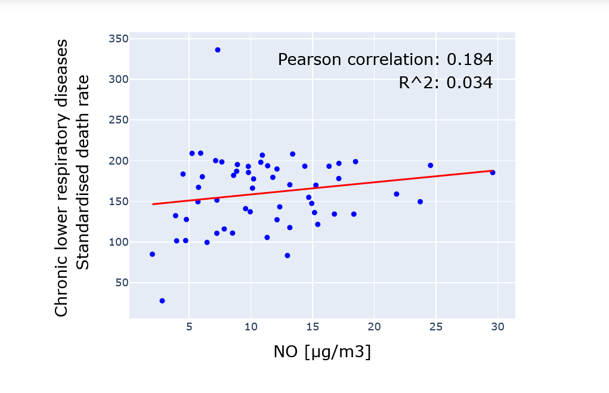

# IDA4Health: Integrative Data Analysis for Healthy Society

## About the project
IDA4Health is a project with a mission to use readily available open-source data in determining environmental influences on disease development. It aims to do that by integrating selected datasets into the computational framework that enables data acquisition, integration and inference of health outcomes in dependence on environmental data. This tool will be used for exact quantification of health risk factors and help us effectively address the mitigation of the spread of non-communicable diseases.

## Background
Despite the vast availability of environmental data, generated by government programs such as ARSO in Slovenia and community initiatives such as Sensor.Community, the integration of this data into inference-based models remains a challenge. While prior studies have explored and analyzed data integration methods for urban datasets [1], we approached the problem through the specific lens of predicting health metrics using open-source datasets.

## Our work
To accomplish this mission, our first step was to identify open-source databases in the scopes of urban environment and health. These databases were carefully assessed and prioritized based on their alignment with our objectives. In our proof of concept, we began by incorporating a select few databases. However, it's worth noting that the available health databases are currently limited to an annual basis and restricted to NUTS2[^1] regional resolution [2]. While health data were already available in NUTS2 data format, others had to be preprocessed or approximated in order to align them with a specific region. However, the architecture of the system does not rely on the NUTS2 data format itself and can be used with various other data formats. After data acquisition, the computational framework integrates the data into a machine learning and inference pipeline. This is achieved through a combination of statistical analysis techniques, such as linear regression analysis, correlation matrix analysis, calculation of correlation coefficients, and the use of the coefficient of determination (R-squared) - see *Figure 1* for example of a plot from the inference framework. Finally, a pilot app was developed as a user interface to showcase our solution.

[^1]: Nomenclature of Territorial Units for Statistics (NUTS) classification system for regions

## Structure of a computational framework

## Proof of concept
We employed our computational framework to analyze a selected set of health, environmental, and urban datasets from corresponding sources – Eurostat [3], European Environment Agency (EEA) [4], and Numbeo [5]. Our integrative analysis focused on 120 European cities with surface area small enough to neglect the heterogeneity of the urban environment. The initial findings indicate modest correlations or no correlations between environmental factors and health outcomes - see *Figure 1*. We are actively striving to optimize our statistical analysis by exploring alternative regression analysis methods and introducing new variables into our models. However, it is worth noting that our existing framework can be readily extended to any other location with accessible datasets, allowing for broader application and analysis.

Figure 1: Example of a plot from the inference framework:  
  correlation of nitric oxide (NO) with a standardised mortality rate of  
  chronic lower respiratory disease. R² = coefficient of determination.

## How you can use it?

## Access to the pilot app

## References:

[1] Murilo Borges Ribeiro; Kelly Rosa Braghetto. A Data Integration Architecture for Smart Cities. Proceedings of the 36th Brazilian Symposium on Databases 2021, 205–216. https://doi.org/10.5753/sbbd.2021.17878 
[2] Eurostat, "Nomenclature of territorial units for statistics". Eurostat; Luxembourg, 1995. 
[3] European Commission, “Eurostat.” https://ec.europa.eu/eurostat/, 2023. 
[4] “EEA: European Air Quality Portal.” https://aqportal.discomap.eea.europa.eu/, 2023. 
[5] Mladen Adamovic, “Numbeo: Cost of Living.” https://www.numbeo.com/, 2023.

## Acknowledgments

This study is part of the project Integrative Data Analysis for Healthy Society (IDA4Health) that is financially supported by Republic of Slovenia and European Union from European Social Fund. 

  

